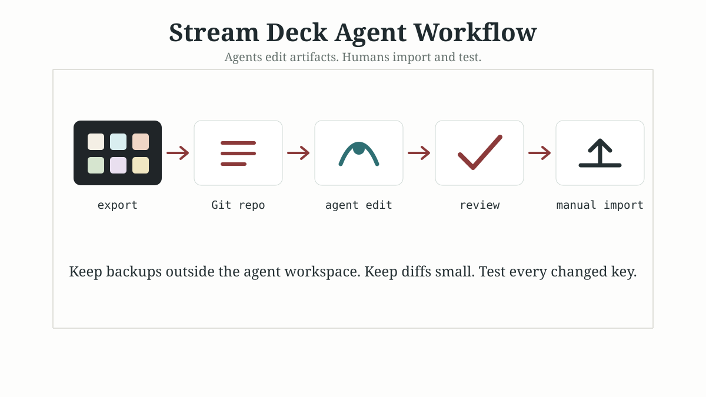

# Stream Deck Agent Workflows

Practical workflows, templates, prompts, and tooling for managing Stream Deck profiles and icons with coding agents such as Codex, Claude Code, Cursor, and similar repo-aware assistants.

This repository is intentionally small, reviewable, and safety-oriented. It is not a Stream Deck plugin and it does not automate your live device directly. The core idea is simple:

> Let agents edit exported artifacts. Let humans import and test them.

## Why this exists

Stream Deck setups tend to grow organically. A few meeting buttons become app launchers, Home Assistant controls, scripts, focus-mode toggles, profile variants, and icon sets that slowly drift apart.

Coding agents are useful for the maintenance work around that setup:

- normalizing icon style and file names
- documenting profiles and pages
- auditing exported actions for missing paths or plugin dependencies
- preparing reviewed profile variants
- keeping prompts and agent instructions consistent

They are much less useful when given direct write access to the live Stream Deck application data. This repo models a safer workflow around exports, Git diffs, and manual import.

## Repository map

```text
streamdeck-agent-workflows/
  AGENTS.md                  # Codex-style repo rules
  CLAUDE.md                  # Claude Code project instructions
  docs/                      # Workflow and safety documentation
  examples/                  # Safe sample inventories and profile notes
  graphics/                  # SVG diagrams and visual assets
  icons/                     # Source SVG icons and generated PNG output folders
  scripts/                   # Small audit/render helper scripts
  templates/                 # Starter files for your own Stream Deck control repo
  tokens/                    # Design tokens for icon rendering
```

## Quick start

Clone the repository and inspect the templates:

```bash
git clone https://github.com/PatrickIsenegger/streamdeck-agent-workflows.git
cd streamdeck-agent-workflows
```

Install optional helper dependencies if you want to render PNGs from the sample SVG icons:

```bash
npm install
npm run render:icons
npm run audit:profile
```

The scripts are deliberately modest. They are meant to show a pattern you can adapt, not to hide Stream Deck management inside a black box.

## Suggested workflow

1. Export a Stream Deck profile or action from the Stream Deck app.
2. Put the export in a separate private working repo, not in this public repo.
3. Add `AGENTS.md`, `CLAUDE.md`, tokens, and templates from this project.
4. Ask a coding agent for a narrow change: one page, one icon family, or one profile variant.
5. Review the diff.
6. Import manually through the Stream Deck app.
7. Test on the device.



## What belongs here

Contributions are welcome when they improve the general workflow without assuming one person's private setup.

Good contributions:

- reusable prompts
- safer agent instructions
- profile audit checks
- icon rendering improvements
- documentation for exported-profile workflows
- sanitized inventories
- vendor-neutral workflow patterns

Avoid contributing:

- real personal profile exports
- machine-specific paths or secrets
- actions for locks, payments, alarms, production deploys, or clinical workflows
- large generated asset dumps
- tooling that edits live Stream Deck application folders by default

## Companion article

This repo was created as a companion project for Patrick Isenegger's article on managing Stream Deck icons and settings with Codex or Claude:

- [Managing Stream Deck Icons with Codex or Claude](https://patrickisenegger.com/en/posts/2026-05-18-managing-stream-deck-icons-with-codex-or-claude/)

## License

This repository uses split licensing:

- Code and scripts are licensed under the MIT License.
- Documentation, templates, prompts, and graphics are licensed under Creative Commons Attribution 4.0 International.

See [LICENSE.md](LICENSE.md) and [NOTICE.md](NOTICE.md) for details.
